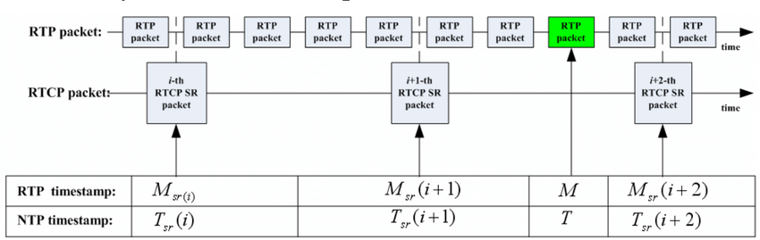

 
<div style="text-align: center;">
<figure>
        
        <figcaption>  <br>RTP and RTCP packets<br>  </figcaption>
</figure>
</div>

source: 2015。A time delay based efficient approach for the synchronization of the audio and video streams-RTP and RTCP packets

## Introduction

`capture_rtsp.sh` is a Bash script for capturing RTSP packets. The script offers functionality to retrieve and validate RTSP URIs from command line arguments, as well as to manage logs and captured data.

## Wireshark Installation Steps
- [2023.06。How to Install and Use Wireshark in Ubuntu 22.04](https://www.linuxtechi.com/install-use-wireshark-ubuntu/)

```
sudo apt update
sudo apt install wireshark -y
```

Add your local user to wireshark group using usermod command

```
sudo usermod -aG wireshark $USER
newgrp wireshark
sudo reboot
```

If the installation is successful, try GUI mode
```
wireshark
```
or commad mode
```
tshark
```

## Usage

1. Grant execution permissions to the script:
   ```bash
   chmod +x capture_rtsp.sh
   ```
2. Run the script and provide RTSP URIs as parameters:
   ```bash
   ./capture_rtsp.sh rtsp://example1.com:8554/stream rtsp://example2.com:8554/stream
   ```

---

### Precautions :warning:

When using `tshark` for extended periods or with a substantial amount of data, you might encounter Out of Memory (OOM) issues. This happens because `tshark` stores captured data in RAM, and if RAM gets exhausted, the system might kill some processes to free up memory, potentially including the `tshark` process. To avoid this, it's recommended to periodically check the memory buffer size (using `top`), or consider increasing the system's RAM.

---

### The main features and characteristics of this script include:

1. **Input Validation**: The script retrieves RTSP URIs from command line arguments and checks whether their format is correct.
2. **Log Management**: It manages log files under the `/tmp/` directory and offers a backup function for logs.
3. **Data Capturing**: Utilizes the `tshark` command to capture RTSP packets.
4. **Cleanup and Exit**: When the script is interrupted, it terminates all initiated RTSP source processes.
5. **Periodic CSV File Management**: Manages the size of the CSV file based on the number of provided RTSP URIs.

This is a script that captures packets using the RTSP protocol by invoking the 'tshark' command-line tool.

### `tshark` command  in this script:

```
stdbuf --output=L tshark  -z rtsp,state -Y 'rtcp.pt==200 || (rtp.p_type==96 && rtp.marker==1)'  
-T fields  -E header=y -E separator=,   -E occurrence=f 
 -e rtcp.senderssrc -e rtcp.timestamp.ntp.msw -e rtcp.timestamp.ntp.lsw -e rtcp.timestamp.rtp -e frame.time_epoch -e rtp.ssrc -e udp.port  -e rtp.timestamp -e rtp.marker  2>errlog1 1> $DIR_LOG/rtsp_capture_$TIMESTAMP.csv
```

1. **stdbuf --output=L**. 
    - `stdbuf` is a command to adjust the stdio buffer for programs running in the pipeline.
    - `--output=L` causes the output to use a line buffer, which means that the output will be flushed immediately after each line instead of accumulating to a certain size and then being flushed.

2. **tshark**. 
    - This is the command-line version of Wireshark, used to capture and analyze network traffic.

3. **-z rtsp,state**.
    - `-z` is used to specify a statistics module.
    - `rtsp,state` is used to collect status information about RTSP streams.

4. **-Y 'rtcp.pt==200 || (rtp.p_type==96 && rtp.marker==1)'**: `-Y` Used to specify a statistics module.
    - `-Y` is used to specify the display filter, which is used to select dataz packets with specific conditions.
    - This filter is used to select data packets with specific criteria. The filtering criteria here is to select RTCP packets of type 200 or RTP packets of type 96 with a mark of 1. 5. **-T fields**: `-Y` is used to specify the display filter.

5. **-T fields**.
    - `-T` Specifies the output format.
    - `fields` Specifies that the output is in field format, rather than the default detailed package description.

6. **-E header=y -E separator=, -E occurrence=f**.
    - `-E` is used to define various options for field output.
        - `header=y` Include the field name as a header in the output.
        - `separator=,` Specifies that the separator between fields is a comma.
        - `occurrence=f` Specifies that if a field occurs more than once in the same packet, only the first occurrence of the value is output.

7. **-e rtcp.senderssrc -e rtcp.timestamp.ntp.msw -e ...**
    - `-e` is used to specify the fields to be output.
    - Each `-e` is followed by the name of the field to be output.
    - Fields used to log RTCP packets, including: ` rtcp.senderssrc rtcp.timestamp.ntp.msw rtcp.timestamp.ntp.lsw rtcp.timestamp.rtp`
    - Fields used to log RTCP packets, including `rtp.ssrc udp.port rtp.timestamp rtp.marker`

8. **2>errlog1**.
    - Redirect standard errors to a file named `errlog1`.

9. **1> $DIR_LOG/rtsp_capture_$TIMESTAMP.csv**: Redirects standard output to a file named `errlog1`.
    - Redirect standard output to the specified csv file, where `$DIR_LOG` and `$TIMESTAMP` are variables that are replaced with their actual values.
 

### [Options] 

1. Grab the complete packet and write it to a tmp*.pcap file and manage it by rotate.

    First, launch the tshark utility to monitor and then launch gstreamer to receive RTSP streams in order for tshark to capture information about the RTSP protocol creation process.

    ```
    tshark -w tmp.pcap -b filesize:10000 -b files:5 -f "host <target ip>"
    ```

    - `-b filesize:10000` 
        - It sets the maximum file size (in kilobytes) for the capture file(s) to 10,000 KB (or 10 MB). When this size is reached, tshark will close the current file and open a new one. This is useful for managing large captures.


    - `-b files:5`
        - This sets the maximum number of files that will be kept before tshark starts overwriting them. In this case, 5 files will be kept. When a sixth file is created (because the filesize limit has been reached five times), the oldest file will be overwritten.

    Combining `-b filesize:10000` and `-b files:5` means tshark will capture packets, writing them to files up to 10 MB each, and it will keep a maximum of 5 files. Once these limits are reached, old data will be overwritten in a rotating manner.

    - `-f "host <target ip>"`
        - This filter instructs tshark to only capture packets where the source or destination IP address is <target ip>. Replace <target ip> with the actual IP address you're interested in. This is useful for reducing the amount of captured data to only what's relevant.

2. Enable the gtsreamer command to receive the packets.
    - Please [install the gstreamer first](https://gstreamer.freedesktop.org/documentation/installing/on-linux.html?gi-language=c)
    
    ```
    gst-launch-1.0 rtspsrc location=<YOUR RTSP URL>  !  fakesink
    # eg:
    # gst-launch-1.0 rtspsrc location= <RTSP URL e.g. rtsp://192.168.1.100:85544/stream1> ! fakesink

    ```

3. Use the following command to read tmp*.pcap.
    ```
    latest_file=$(ls -t |grep pcap| head -n 1) 
    tshark -r ${latest_file} -z rtsp,state \
        -Y 'rtcp.pt==200 || (rtp.p_type==96 && rtp.marker==1)' \
        -T fields  -E header=y -E separator=,   -E occurrence=f \
        -e frame.time_epoch -e rtcp.senderssrc -e rtcp.timestamp.ntp.msw -e rtcp.timestamp.ntp.lsw -e rtcp.timestamp.rtp  -e rtp.ssrc -e udp.port  -e rtp.timestamp -e rtp.marker
    ```

## Explore rtsp_capture*.csv with jupyternotebook
See `explore_rtsp_capture.ipynb`


## Reference
- [www.wireshark.org/docs/man-pages/tshark](https://www.wireshark.org/docs/man-pages/tshark.html)
- [2023.06。How to Install and Use Wireshark in Ubuntu 22.04](https://www.linuxtechi.com/install-use-wireshark-ubuntu/)
- [2021。Shanto Roy。How to Convert PCAP files to CSV for Network Traffic Analysis](https://shantoroy.com/networking/convert-pcap-to-csv-using-tshark/)
* [2020。wiki.wireshark.org/KnownBugs/OutOfMemory](https://wiki.wireshark.org/KnownBugs/OutOfMemory)
* [2014。To Infinity and Beyond! Capturing Forever with Tshark](https://blog.wireshark.org/2014/07/to-infinity-and-beyond-capturing-forever-with-tshark/)
